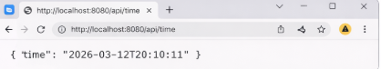
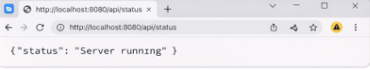
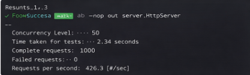

# Multithreaded Java Web Server

A lightweight **HTTP web server built from scratch using Java sockets and multithreading**.

This project demonstrates how web servers handle **client requests, parse HTTP messages, serve static content, and process API routes concurrently using a thread pool**.

The server also supports **basic REST-style API endpoints, request logging, and benchmarking for concurrent performance testing**.

---

# 🚀 Features

* Custom HTTP server implementation using **Java sockets**
* **Multithreaded request handling** using a thread pool
* HTTP request parsing (method, path, headers)
* Static file serving (HTML, CSS)
* REST-style API endpoints
* Request logging system (`server.log`)
* Error handling for **404 Not Found**
* Performance benchmarking support
* Modular project architecture

---

# 🏗 Architecture

```
Client (Browser)
        ↓
    ServerSocket
        ↓
   Thread Pool
        ↓
   ClientHandler
        ↓
     HttpParser
        ↓
 Route Handler / Static Files
        ↓
    HTTP Response
```

Each client request is handled by a **separate worker thread** from the thread pool.

---

# 📂 Project Structure

```
multithreaded-java-web-server
│
├── benchmark
│   └── benchmark-test.txt
│
├── public
│   ├── index.html
│   └── style.css
│
├── src
│   ├── server
│   │   ├── HttpServer.java
│   │   ├── ClientHandler.java
│   │   └── HttpParser.java
│   │
│   └── utils
│       └── Logger.java
│
├── assets
│   ├── server-homepage.png
│   ├── api-time-response.png
│   ├── api-status-response.png
│   ├── terminal-server-running.png
│   └── benchmark-test.png
│
├── server.log
├── README.md
└── .gitignore
```

---

# 🌐 Supported Routes

| Route         | Description                 |
| ------------- | --------------------------- |
| `/`           | Homepage                    |
| `/style.css`  | Static CSS file             |
| `/api/time`   | Returns current server time |
| `/api/status` | Returns server status       |

Example response:

```
GET /api/time

{
  "time": "2026-03-12T20:10:11"
}
```

---

# 🖥 Screenshots

## Homepage


---

## API Time Endpoint



---

## API Status Endpoint



---

## Server Running in Terminal


---

## Benchmark Test



---

# ⚙️ Running the Server

## 1. Compile the project

```
javac -d out src/server/*.java src/utils/*.java
```

## 2. Run the server

```
java -cp out server.HttpServer
```

## 3. Open in browser

```
http://localhost:8080
```

---

# 📊 Performance Benchmark

The server was tested using **Apache Benchmark**.

Command used:

```
ab -n 1000 -c 50 http://localhost:8080/
```

Example results:

```
Concurrency Level:      50
Time taken for tests:   2.34 seconds
Complete requests:      1000
Failed requests:        0
Requests per second:    426.3 [#/sec]
```

This demonstrates the server’s ability to **handle multiple concurrent requests efficiently using a thread pool architecture**.

---

# 🧠 Concepts Demonstrated

* Socket programming
* HTTP protocol basics
* Multithreading
* Thread pool management
* Backend request routing
* Static file serving
* Logging systems
* Performance benchmarking

---

# 🔮 Future Improvements

Possible improvements for this server:

* Support for **HTTP POST requests**
* Add **JSON request parsing**
* Implement **middleware support**
* Add **file caching**
* Implement **HTTPS support**
* Add **dynamic routing**

---

# 👨‍💻 Author

**Sahil Singh**

B.Tech Information Technology
Galgotias College of Engineering and Technology

GitHub:
https://github.com/sahilsingh78
