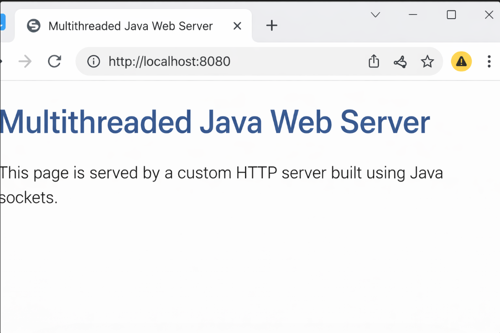

# Multithreaded Java Web Server

A lightweight **HTTP web server built from scratch using Java sockets and multithreading**.
This project demonstrates how web servers handle **client requests, parse HTTP messages, and serve static content concurrently**.

The server supports multiple client connections using a **thread pool architecture**, parses HTTP requests, and serves static files such as HTML and CSS.

---

## 🚀 Features

* Custom HTTP server implementation using **Java sockets**
* **Multithreaded request handling** using a thread pool
* HTTP request parsing (method, path, headers)
* Static file serving (HTML, CSS)
* Basic **logging system**
* Error handling for **404 Not Found**
* Simple modular architecture

---

## 🏗 Architecture

```
Browser
   ↓
ServerSocket (Port 8080)
   ↓
Thread Pool
   ↓
ClientHandler
   ↓
HttpParser
   ↓
Static File Response
```

The server listens for incoming connections and assigns each request to a **worker thread** from the thread pool.

---

## 📂 Project Structure

```
multithreaded-web-server
│
├── public
│   ├── index.html
│   └── style.css
│
├── src
│   ├── server
│   │   ├── HttpServer.java
│   │   ├── ClientHandler.java
│   │   └── HttpParser.java
│   │
│   └── utils
│       └── Logger.java
│
└── README.md
```

---

## ⚙️ How It Works

1. The server starts and listens on **port 8080**.
2. When a client connects, the request is assigned to a **thread from the thread pool**.
3. The request is parsed using the `HttpParser`.
4. The server determines the requested file path.
5. If the file exists → return **200 OK** with file content.
6. If the file does not exist → return **404 Not Found**.

---

## ▶️ Running the Server

### 1. Compile the project

```
javac -d out src/server/*.java src/utils/*.java
```

### 2. Run the server

```
java -cp out server.HttpServer
```

### 3. Open in browser

```
http://localhost:8080
```

---

## 📸 Example Output
```
Multithreaded Java Web Server
This page is served by a custom HTTP server built using Java sockets.
```

---

## 🧠 Concepts Demonstrated

* Socket programming
* HTTP protocol basics
* Multithreading
* Thread pool management
* File I/O
* Backend server architecture

---

## 🔧 Future Improvements

* Support for **HTTP POST requests**
* Add **REST API routes**
* Implement **request logging to files**
* Add **MIME type detection**
* Implement **basic caching**
* Add **performance benchmarking**

---

## 👨‍💻 Author

**Sahil**

B.Tech Information Technology
Galgotias College of Engineering and Technology

GitHub: https://github.com/sahilsingh78
